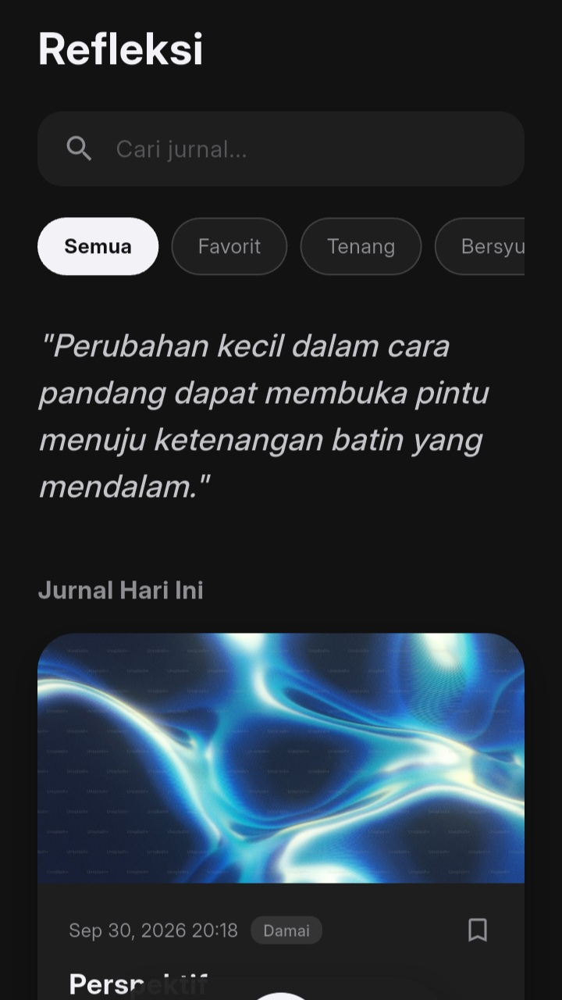
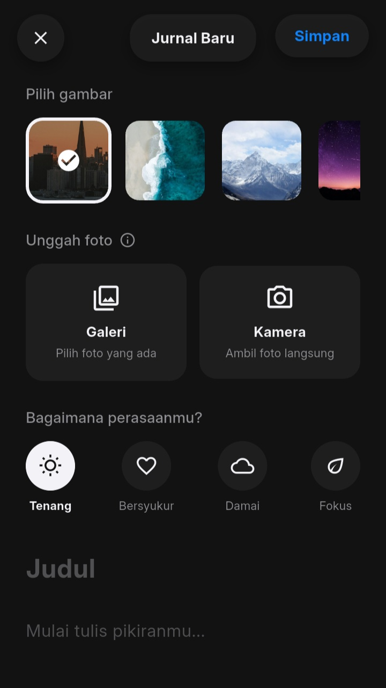
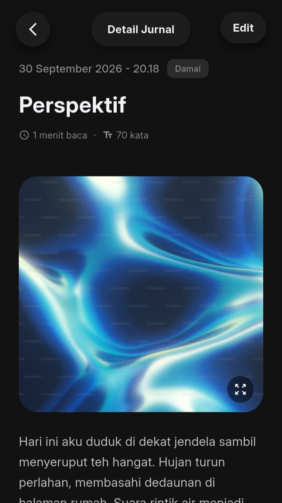
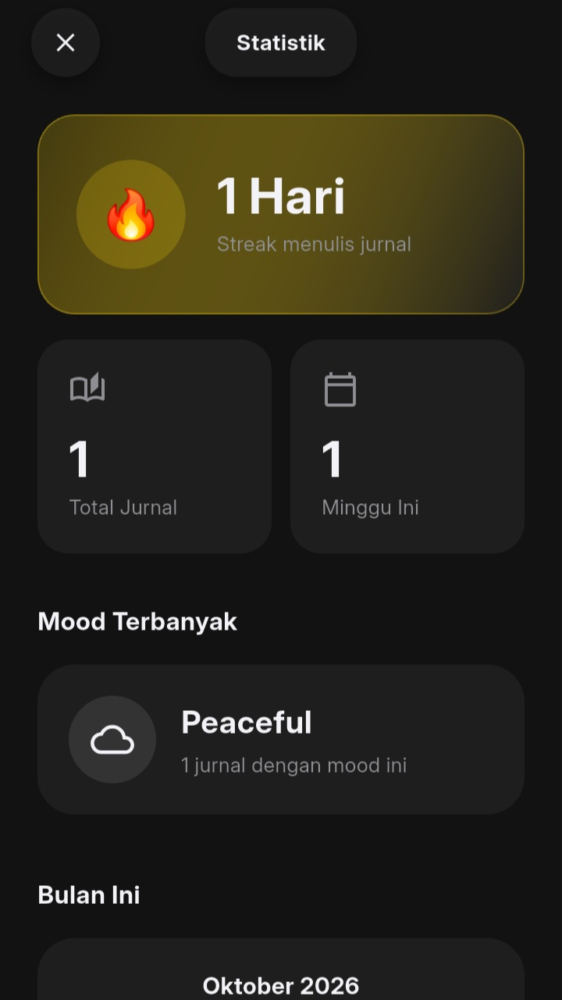

# NoteNest

Adalah aplikasi jurnal pribadi dengan fitur lengkap: tulis jurnal, unggah foto dari galeri atau kamera, lacak mood harian, dan pantau statistik semua jurnal yang ada secara offline, dan mendukung dua bahasa.

---

> [!WARNING]
> **NoteNest** ini sedang dalam tahap pengembangan aktif untuk memperbaiki fitur atau sistem lainnya. Versi saat ini secara fitur semua sudah berfungsi dengan baik. Fitur baru akan ditambahkan secara bertahap.

---

<h1>Features</h1>

<table>
  <tr>
    <td width="50%" valign="top">

#### Menulis Jurnal
- Tulis, edit, dan hapus jurnal
- Tanggal & waktu otomatis
- Reading time & word count
- Waktu terakhir diedit
- Mode gelap

</td>
    <td width="50%" valign="top">

#### Foto & Mood
- 8 preset gambar estetik
- Unggah foto dari galeri
- Ambil foto langsung dari kamera
- Lacak mood dengan 4 pilihan
- Tandai jurnal sebagai favorit

</td>
  </tr>
  <tr>
    <td width="50%" valign="top">

#### Pencarian & Filter
- Cari jurnal berdasarkan judul & isi
- Filter berdasarkan mood
- Filter favorit
- Tampilan daftar yang bersih

</td>
    <td width="50%" valign="top">

#### Statistik
- Streak menulis jurnal
- Kalender bulanan
- Grafik mingguan
- Distribusi mood
- Mood terbanyak

</td>
  </tr>
  <tr>
    <td width="50%" valign="top">

#### Notifikasi & Pengingat
- Pengingat harian
- Pesan kustom
- Pilih jam sendiri
- Notifikasi tetap muncul setelah HP restart

</td>
    <td width="50%" valign="top">

#### Lainnya
- Multi-bahasa (Inggris & Indonesia)
- Ekspor jurnal ke file
- 100% offline dengan Hive
- Animasi & haptic feedback

</td>
  </tr>
</table>

---

## Screenshots

  
  
  
  

---

## Tech Stack

| Kategori | Teknologi |
| :--- | :--- |
| **Framework** | Flutter 3.44.1 |
| **Bahasa** | Dart 3.x |
| **Database** | Hive (Local NoSQL) |
| **State Management** | StatefulWidget + ValueListenableBuilder |
| **Notifikasi** | flutter_local_notifications |
| **Kamera & Galeri** | image_picker |
| **Grafik** | fl_chart |
| **Lokalisasi** | intl + flutter_localizations |
| **Share** | share_plus |
| **Font** | Inter |

---

## Developer

**Feri** — Aspiring Software Engineer

---

## Lisensi

© 2026. Hak cipta dilindungi.
